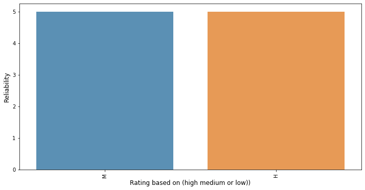
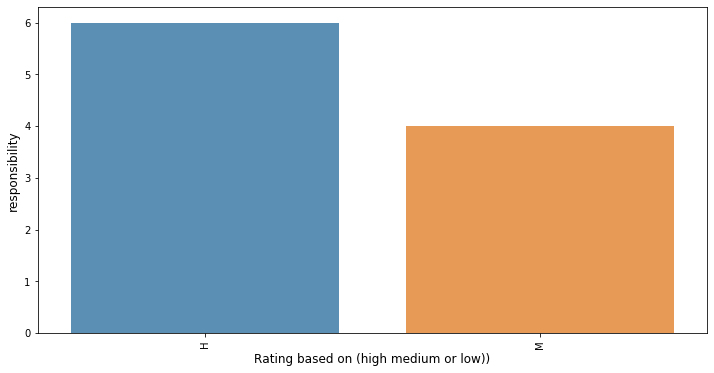
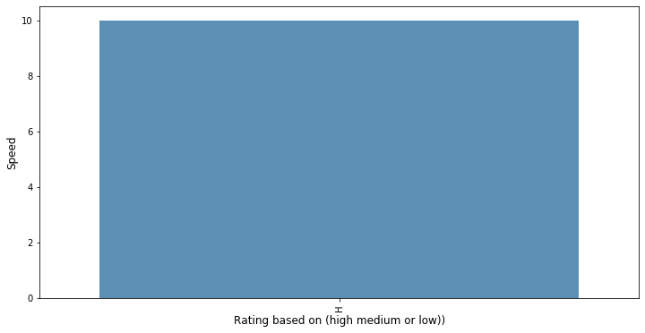
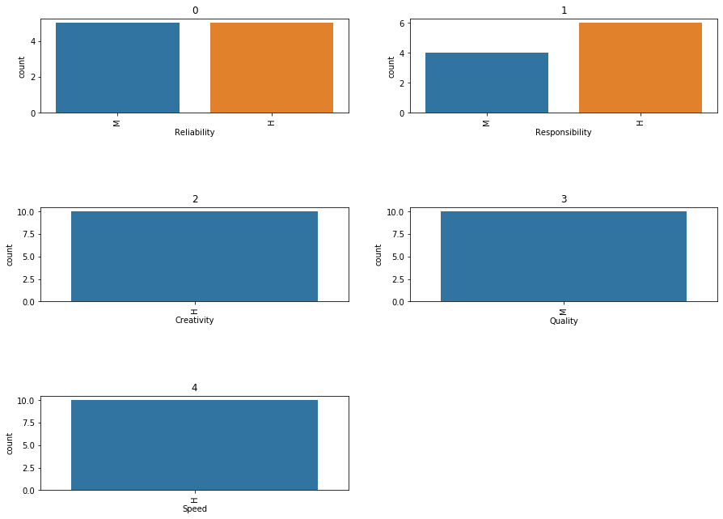
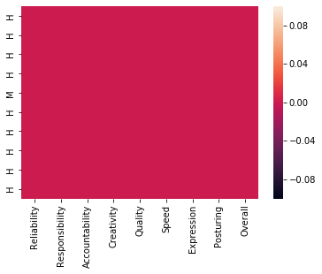

# EXPLORATORY DATA ANALYSIS
Exploratory Data Analysis is an initial process of analysis, in which you can summarize characteristics of data such as pattern, trends, outliers, and hypothesis testing using descriptive statistics and visualization.


```python
#import modules
import matplotlib.pyplot as plt # for plotting graphs
import seaborn as sns # for plotting graphs
% matplotlib inline
import numpy

```

    UsageError: Line magic function `%` not found.


```python
import pandas
data=pandas.read_csv('/Users/rs/PycharmProjects/EXCEL_To_SQL/data/emp1_details.csv')
```


```python
data.head()
```


<div>
<style scoped>
    .dataframe tbody tr th:only-of-type {
        vertical-align: middle;
    }

    .dataframe tbody tr th {
        vertical-align: top;
    }

    .dataframe thead th {
        text-align: right;
    }
</style>
<table border="1" class="dataframe">
  <thead>
    <tr style="text-align: right;">
      <th></th>
      <th>Reliability</th>
      <th>Responsibility</th>
      <th>Accountability</th>
      <th>Creativity</th>
      <th>Quality</th>
      <th>Speed</th>
      <th>Expression</th>
      <th>Posturing</th>
      <th>Overall</th>
    </tr>
  </thead>
  <tbody>
    <tr>
      <th>H</th>
      <td>M</td>
      <td>M</td>
      <td>M</td>
      <td>H</td>
      <td>M</td>
      <td>H</td>
      <td>L</td>
      <td>H</td>
      <td>M</td>
    </tr>
    <tr>
      <th>H</th>
      <td>H</td>
      <td>H</td>
      <td>H</td>
      <td>H</td>
      <td>M</td>
      <td>H</td>
      <td>L</td>
      <td>H</td>
      <td>M</td>
    </tr>
    <tr>
      <th>H</th>
      <td>H</td>
      <td>H</td>
      <td>H</td>
      <td>H</td>
      <td>M</td>
      <td>H</td>
      <td>L</td>
      <td>H</td>
      <td>M</td>
    </tr>
    <tr>
      <th>H</th>
      <td>H</td>
      <td>H</td>
      <td>H</td>
      <td>H</td>
      <td>M</td>
      <td>H</td>
      <td>L</td>
      <td>H</td>
      <td>M</td>
    </tr>
    <tr>
      <th>M</th>
      <td>M</td>
      <td>M</td>
      <td>M</td>
      <td>H</td>
      <td>M</td>
      <td>H</td>
      <td>L</td>
      <td>H</td>
      <td>M</td>
    </tr>
  </tbody>
</table>
</div>


```python
data.info()
```

    <class 'pandas.core.frame.DataFrame'>
    Index: 10 entries, H to H
    Data columns (total 9 columns):
    Reliability       10 non-null object
    Responsibility    10 non-null object
    Accountability    10 non-null object
    Creativity        10 non-null object
    Quality           10 non-null object
    Speed             10 non-null object
    Expression        10 non-null object
    Posturing         10 non-null object
    Overall           10 non-null object
    dtypes: object(9)
    memory usage: 800.0+ bytes


## You can describe 10 attributes in detail as:

- Reliability: It is employees Power of word - describing if he says what he means and means what he says- which ranges as H-High,M-Medium,L-Low.
- Responsibility: Describes how committed an employee is - again scaled H-High,M-Medium,L-Low.
- Accountability: How is he able to manage his time- H-High,M-Medium,L-Low.
- Creativity: Is he a problem Solver - H-High,M-Medium,L-Low.
- Quality: Effectiviness and sustainability of an employee - scaled on H-High,M-Medium,L-Low.
- Speed: Measures the efficiency of an employee- scaled again on H-High,M-Medium,L-Low.
- Expression: Perception management of an individual - scaled as H-High,M-Medium,L-Low.
- Posturing: whether a person is a player, spectator, umpire, commenator in life
- Overall: Overall feedback 

## FINDING SOME INSIGHTS FROM THIS DATA


```python
data.describe()
```


<div>
<style scoped>
    .dataframe tbody tr th:only-of-type {
        vertical-align: middle;
    }

    .dataframe tbody tr th {
        vertical-align: top;
    }

    .dataframe thead th {
        text-align: right;
    }
</style>
<table border="1" class="dataframe">
  <thead>
    <tr style="text-align: right;">
      <th></th>
      <th>Reliability</th>
      <th>Responsibility</th>
      <th>Accountability</th>
      <th>Creativity</th>
      <th>Quality</th>
      <th>Speed</th>
      <th>Expression</th>
      <th>Posturing</th>
      <th>Overall</th>
    </tr>
  </thead>
  <tbody>
    <tr>
      <th>count</th>
      <td>10</td>
      <td>10</td>
      <td>10</td>
      <td>10</td>
      <td>10</td>
      <td>10</td>
      <td>10</td>
      <td>10</td>
      <td>10</td>
    </tr>
    <tr>
      <th>unique</th>
      <td>2</td>
      <td>2</td>
      <td>2</td>
      <td>1</td>
      <td>1</td>
      <td>1</td>
      <td>1</td>
      <td>1</td>
      <td>1</td>
    </tr>
    <tr>
      <th>top</th>
      <td>M</td>
      <td>H</td>
      <td>H</td>
      <td>H</td>
      <td>M</td>
      <td>H</td>
      <td>L</td>
      <td>H</td>
      <td>M</td>
    </tr>
    <tr>
      <th>freq</th>
      <td>5</td>
      <td>6</td>
      <td>8</td>
      <td>10</td>
      <td>10</td>
      <td>10</td>
      <td>10</td>
      <td>10</td>
      <td>10</td>
    </tr>
  </tbody>
</table>
</div>


### Visualising the number of 'H' for the emplyee


```python
Total_feedbacks=data['Speed'].count()

```


```python
print(Total_feedbacks)


```

    10


### creating different rows


```python

#Transaction Date:

#Now let us explore the date field. Let us first check the number of transactions in each month.


cnt_srs = data['Reliability'].value_counts()
plt.figure(figsize=(12,6))
sns.barplot(cnt_srs.index, cnt_srs.values, alpha=0.8)
plt.xticks(rotation='vertical')
plt.xlabel('Rating based on (high medium or low))', fontsize=12)
plt.ylabel('Reliability', fontsize=12)
plt.show()


cnt_srs = data['Responsibility'].value_counts()
plt.figure(figsize=(12,6))
sns.barplot(cnt_srs.index, cnt_srs.values, alpha=0.8)
plt.xticks(rotation='vertical')
plt.xlabel('Rating based on (high medium or low))', fontsize=12)
plt.ylabel('responsibility', fontsize=12)
plt.show()

cnt_srs = data['Creativity'].value_counts()
plt.figure(figsize=(12,6))
sns.barplot(cnt_srs.index, cnt_srs.values, alpha=0.8)
plt.xticks(rotation='vertical')
plt.xlabel('Rating based on (high medium or low))', fontsize=12)
plt.ylabel('Creativity', fontsize=12)
plt.show()

cnt_srs = data['Expression'].value_counts()
plt.figure(figsize=(12,6))
sns.barplot(cnt_srs.index, cnt_srs.values, alpha=0.8)
plt.xticks(rotation='vertical')
plt.xlabel('Rating based on (high medium or low))', fontsize=12)
plt.ylabel('Expression', fontsize=12)
plt.show()

cnt_srs = data['Speed'].value_counts()
plt.figure(figsize=(12,6))
sns.barplot(cnt_srs.index, cnt_srs.values, alpha=0.8)
plt.xticks(rotation='vertical')
plt.xlabel('Rating based on (high medium or low))', fontsize=12)
plt.ylabel('Speed', fontsize=12)
plt.show()

cnt_srs = data['Quality'].value_counts()
plt.figure(figsize=(12,6))
sns.barplot(cnt_srs.index, cnt_srs.values, alpha=0.8)
plt.xticks(rotation='vertical')
plt.xlabel('Rating based on (high medium or low))', fontsize=12)
plt.ylabel('Quality', fontsize=12)
plt.show()
```











```python

columns_name=['Reliability','Responsibility','Creativity','Quality','Speed']
fig=plt.subplots(figsize=(15,15))
for i, j in enumerate(columns_name):
    plt.subplot(4, 2, i+1)
    plt.subplots_adjust(hspace = 1.0)
    sns.countplot(x=j,data = data)
    plt.xticks(rotation=90)
    plt.title(i)
```





```python
data.info()

```

    <class 'pandas.core.frame.DataFrame'>
    Index: 10 entries, H to H
    Data columns (total 9 columns):
    Reliability       10 non-null object
    Responsibility    10 non-null object
    Accountability    10 non-null object
    Creativity        10 non-null object
    Quality           10 non-null object
    Speed             10 non-null object
    Expression        10 non-null object
    Posturing         10 non-null object
    Overall           10 non-null object
    dtypes: object(9)
    memory usage: 1.1+ KB


```python
categorical = []
for column in data:
    if data[column].dtype == 'object':
        categorical.append(column)
categorical
```


    ['Reliability',
     'Responsibility',
     'Accountability',
     'Creativity',
     'Quality',
     'Speed',
     'Expression',
     'Posturing',
     'Overall']


```python
sns.heatmap(data.isna())
```


    <matplotlib.axes._subplots.AxesSubplot at 0x11cf2c340>





```python
emp_details=pandas.read_csv('/Users/rs/PycharmProjects/EXCEL_To_SQL/data/details_emp.csv')
```


```python
emp_details.info
```


    <bound method DataFrame.info of                   Name           Designation Role Played Currently  \
    0            PAVAN RAJ                    RH          RETAIL SALES   
    1       SOMESH KARTICK         RETAIL DEALER               BROKING   
    2          SHRIDHARA K                DEALER               DEALING   
    3        RAGHAVENDRA R                DEALER               TRADING   
    4          PRASHANTH R  RELATIONSHIP MANAGER                   NaN   
    5         SUJATA NAYAK         SENIOR DEALER     REVNUE GENERATION   
    6           PRUTHVI H                 DEALER                   NaN   
    7  MUTHUPALANIYAPPAN C         SENIOR DEALER  RELATIONSHIP MANAGER   
    8        RAJESH PRABHU                DEALER  RELATIONSHIP MANGAER   
    
               Reliability         Responsibility       Accountability  \
    0  H,H,H,H,H,M,H,H,H,H    M,H,H,H,H,M,H,H,M,H  M,H,H,H,M,M,M,M,H,H   
    1    H,H,H,M,H,M,H,H,M    H,H,M,M,H,H,H,H,H,H  H,H,M,M,M,M,H,M,H,H   
    2  M,M,M,M,H,H,H,M,M,M  L,M,M,M,M,M,M,M,M,M,M  H,H,L,M,L,L,L,L,M,H   
    3  H,H,H,H,M,H,M,M,M,M    H,M,L,M,M,M,M,H,M,H  M,H,L,H,M,M,M,M,H,M   
    4  H,H,H,H,H,H,H,M,M,H    H,H,H,M,M,M,M,M,H,H  H,H,H,H,H,M,M,M,H,H   
    5        M,H,H,H,M,H,M          M,H,H,M,H,H,M        M,H,H,M,M,M,M   
    6      M,M,H,M,M,M,L,M        L,H,H,M,M,M,M,M      M,M,M,M,M,M,L,M   
    7      M,M,M,M,L,M,M,H        M,M,M,H,H,H,L,H      M,M,M,M,M,M,M,H   
    8      M,M,H,H,H,H,H,M        M,H,M,H,M,M,M,M      M,H,M,H,H,M,M,M   
    
                Creativity              Quality                Speed  \
    0  M,H,H,H,M,M,M,H,M,H  M,H,H,H,H,M,H,H,H,H  M,H,M,L,M,M,H,H,M,H   
    1  H,H,H,L,L,L,H,M,M,M  H,H,H,M,M,H,H,M,M,M  H,H,M,L,M,M,M,M,M,M   
    2  M,L,L,M,L,L,L,M,M,H  L,M,L,H,M,M,M,M,M,H  L,M,M,M,H,H,H,M,M,M   
    3  H,L,L,L,L,M,L,L,M,M  M,H,H,H,H,M,M,H,H,M  L,M,L,M,M,L,L,M,H,H   
    4  H,H,H,M,L,M,L,L,H,H  H,H,H,H,H,H,L,L,H,H  H,H,H,M,M,H,L,L,H,H   
    5        L,H,M,M,L,M,M        L,H,H,M,H,M,M        L,H,H,M,L,M,M   
    6     L,L,L,M,M,M,L,L,      M,M,M,M,H,H,M,M      L,L,L,M,H,L,L,H   
    7      M,H,M,M,M,L,L,H      L,M,M,H,L,L,L,H      H,M,M,H,L,M,M,H   
    8      M,M,M,H,H,H,H,H      M,M,H,H,M,M,M,H      L,L,M,M,M,M,M,M   
    
                Expression                      Posturing              Overall  
    0  M,H,M,L,M,M,H,H,H,H  UM,SP,UM,UM,PL,PL,UM,PL,PL,PL  M,T,G,G,G,M,G,T,T,T  
    1  H,H,H,L,L,L,H,H,M,M  UM,PL,CM,PL,PL,CM,CM,PL,PL,PL  T,T,T,T,G,G,T,T,T,T  
    2  L,M,M,M,M,M,M,M,M,M  SP,PL,PL,UM,UM,UM,UM,UM,PL,PL  T,T,T,T,G,G,G,G,T,T  
    3  M,L,M,M,L,M,M,M,H,M  CM,UM,CM,CM,CM,CM,UM,CM,UM,PL  M,T,T,T,T,T,M,M,M,M  
    4  H,H,H,L,L,M,M,M,H,H     PL,CM,UM,PL,UM,UM,SP,SP,SP  H,G,T,G,M,M,G,G,G,G  
    5      L,H,H,M,M,M,L,M           CM,CM,CM,CM,CM,CM,PL        T,G,T,T,T,M,T  
    6      H,H,M,M,H,H,M,M        PL,PL,PL,PL,PL,PL,CM,PL      T,M,T,T,M,M,M,M  
    7      M,L,L,L,M,L,L,H        PL,CM,CM,SP,SP,CM,PL,PL      M,T,T,M,G,M,M,M  
    8      L,L,L,L,L,L,L,M        SP,SP,SP,SP,SP,SP,SP,SP      T,T,T,G,G,T,G,G  >


```python
print(emp_details.Speed[0])
```

### To retrieve the average rating for each category


```python
from scipy import stats
required_categories=[]
emp_name=[]
emp_name=list(emp_details.Name)

required_categories = emp_details.columns[3:]
number_of_employee=10
```


```python
print(required_categories)
print(emp_name)

```

    Index(['Reliability', 'Responsibility', 'Accountability', 'Creativity',
           'Quality', 'Speed', 'Expression', 'Posturing', 'Overall'],
          dtype='object')
    ['PAVAN RAJ', 'SOMESH KARTICK', 'SHRIDHARA K', 'RAGHAVENDRA R', 'PRASHANTH R', 'SUJATA NAYAK', 'PRUTHVI H ', 'MUTHUPALANIYAPPAN C', 'RAJESH PRABHU']


```python
det_emp=[]
mode_= 0
for i in required_categories:
    print(emp_name[0])
    print(i,stats.mode(emp_details[i][1][0])[0])
    mode_=stats.mode(emp_details[i][1][0])[0]
    det_emp.append(mode_)
```

    PAVAN RAJ
    Reliability ['H']
    PAVAN RAJ
    Responsibility ['H']
    PAVAN RAJ
    Accountability ['H']
    PAVAN RAJ
    Creativity ['H']
    PAVAN RAJ
    Quality ['H']
    PAVAN RAJ
    Speed ['H']
    PAVAN RAJ
    Expression ['H']
    PAVAN RAJ
    Posturing ['U']
    PAVAN RAJ
    Overall ['T']


```python
print(det_emp)
```

    [array(['H'], dtype='<U1'), array(['H'], dtype='<U1'), array(['H'], dtype='<U1'), array(['H'], dtype='<U1'), array(['H'], dtype='<U1'), array(['H'], dtype='<U1'), array(['H'], dtype='<U1'), array(['U'], dtype='<U1'), array(['T'], dtype='<U1')]


```python

```
